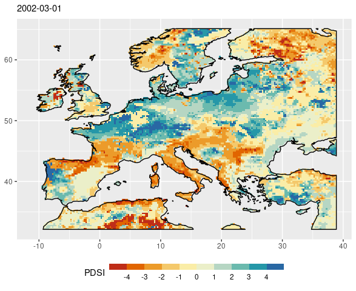
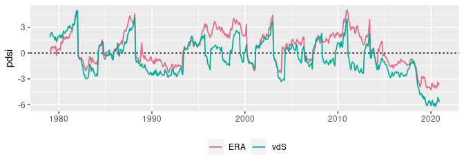
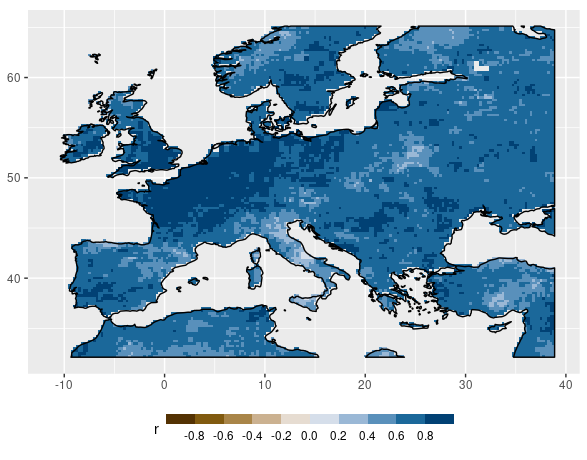

Report 1: scPDSI with ERA5
================
Carlos Dobler

-   [1. PDSI with ERA5’s potential
    evaporation](#1-pdsi-with-era5s-potential-evaporation)
-   [2. PDSI with Thornthwaite’s PET
    formulation](#2-pdsi-with-thornthwaites-pet-formulation)
-   [3. PDSI with Penman-Monteith’s PET
    formulation](#3-pdsi-with-penman-monteiths-pet-formulation)
-   [4. PDSI with Penman-M + AWC](#4-pdsi-with-penman-m--awc)
-   [5. Comparison between ERA5-derived PDSI
    results](#5-comparison-between-era5-derived-pdsi-results)
-   [Bonus: Penman-M with CO2
    adjustment](#bonus-penman-m-with-co2-adjustment)

Here I show results of a series of test runs for calculating scPDSI
using ERA5 Reanalysis data with the R package `scPDSI`. All tests were
ran for a region centered on ~~Mexico~~ Central Europe. Of the variables
that scPDSI asks for, the only ones that would vary were monthly
precipitation and monthly potential evapotranspiration (PET). AWC
remained constant (100 mm), and the start and end calibration dates
included the whole period (1979-2020). I used three PET formulations:
one uses the “raw” potential evaporation from ERA5 Reanalysis data (no
transpiration); another one uses Thornthwaite’s PET formulation
calculated with the R package `SPEI`; the last one uses a script I wrote
to calculate Penman-Monteith’s PET formulation based on [this
document](https://edis.ifas.ufl.edu/pdf%5CAE%5CAE459%5CAE459-4802269.pdf)
and incorporating [Yang et al.’s
2019](https://doi.org/10.1038/s41558-018-0361-0) and [Bliss Singer et
al.’s 2021](https://www.nature.com/articles/s41597-021-01003-9)
modifications (see [here](penman_mine.R) for the script). Results were
compared against [van der Schrier et
al.’s](https://doi.org/10.1002/jgrd.50355) latest scPDSI dataset based
on CRU.

## 1. PDSI with ERA5’s potential evaporation

Map of a random date:

### 1.1. Temporal correlation

The following figure correlates my results against van der Schrier’s on
a per-pixel basis (i.e. time-series vs time-series). Correlation varies
spatially, with some regions displaying a negative coefficient:

If I randomly choose a pixel with a **high** correlation coefficient (r
= 0.8), its time-series look like this:

If I choose one with a **low** correlation coefficient (r = 0.15):

### 1.2. Spatial correlation

The following figure shows the spatial correlation between my results
and van der Schrier’s on a monthly basis (i.e. my resulting map at time
*n* vs. VDS at time *n*). We can see correlation coefficients fluctuate
in a “wave-like” form, overall descending over time:

If I randomly choose a date with **high-ish** spatial correlation (r =
0.65), the two maps look like this:

If I choose one with **low** correlation (r = 0.1):

## 2. PDSI with Thornthwaite’s PET formulation

Thornthwaite’s PET formulation uses two variables: average temperature
and latitude.

Map of a random date:

### 2.1. Temporal correlation

Per-pixel correlation of my results based on Thornthwaite vs van der
Schrier’s shows a drastic improvement over previous results. All cells
show positive correlations, and most of them with high coefficients.

If I randomly choose a pixel with **high** correlation (r = 0.8), its
time-series look like this:

And one with **low** correlation (r = 0.15):

### 2.2. Spatial correlation

Spatially, correlation between my results and van der Schrier’s
fluctuates between \~0.2 and \~0.7, again, in a “wave-like” form:

If I randomly choose a date when correlation was **high-ish** (r = 0.65)
it looks like this:

And a date when correlation was **low** (r = 0.1):

## 3. PDSI with Penman-Monteith’s PET formulation

Penman-Monteith’s PET formulation can include several variables; some
are used to derive others. In this case, I used: mean temperature, wind
speed, radiance, dewpoint temperature (to derive vapor pressure), and
elevation (I used ERA5 geopotential height divided by the Earth’s
gravitational acceleration, g = 9.8 m/s).

Map of a random date:

### 3.1. Temporal correlation

Correlation coefficients on a per-pixel basis are very similar (almost
identical) to those obtained with Thornthwaite’s PET formulations:

If I randomly choose a pixel with **high** correlation (r = 0.8):

And one with **low** correlation (r = 0.2):

### 3.2. Spatial correlation

The spatial correlation trend also looks very similar to previous
results, although the “overall” trend (blue line) is slightly lower:

If I randomly choose a date with **high-ish** correlations (r = 0.65):

And one with **low** correlations (r = 0.2):

## 4. PDSI with Penman-M + AWC

AWC is a variable required in the calculation of PDSI. I found several
AWC datasets, but all of them are quite complicated to obtain and
process (they are distributed in either antique, bizarre, or proprietary
data formats). Before going through the pain of dealing with this, I ran
an experiment to see to what extent AWC could improve results. The
experiment consists of altering AWC values iteratively for each pixel
and choose the one that gets me “the best” PDSI (i.e. the one that
correlates the highest with van der Schrier). Thus, while in the former
runs AWC was kept constant (100 mm), here it can have values from 5 to
215 mm for each pixel.

This is how the “artificial” AWC layer looks like:

### 4.1. Temporal correlation

Unfortunately, the incorporation of AWC does not seem to change results
in a substantial way:

### 4.2. Spatial correlation

…although spatially it does seem to slightly improve correlations
(interestingly, the patterns is very similar to the run with
Thornthwaite):

## 5. Comparison between ERA5-derived PDSI results

How do all previous results compare (i.e. correlate) to each other? With
the exception of those obtained with ERA5’s potential evaporation
(section 1), the rest of the results correlate extremely well with each
other - in other words, they are **almost** identical.

## Bonus: Penman-M with CO2 adjustment

Here I incorporated the CO2 adjustment into Penman-M’s PET formulation
following [Yang et al. 2019](https://doi.org/10.1038/s41558-018-0361-0).

### 6.1. Temporal correlation

Results show a similar pattern of temporal correlation with van der
Schrier compared to previous results:

### 6.2. Spatial correlation

However, overall spatial correlation shows now a declining trend over
time:

