scPDSI tests
================
Carlos Dobler

Here I show results of a series of test runs for calculating scPDSI with
the R package `scpdsi`. All tests were ran for a region centered on
~~Mexico~~ Central Europe to reduce processing times. Of the variables
that scPDSI asks for, the only ones that would vary were monthly
precipitation and monthly potential evapotranspiration (PET). AWC
remained constant (100 mm), and the start and end dates for calibration
included the whole period. I used four PET formulations: one uses the
“raw” potential evaporation from ERA5 Reanalysis data (no
transpiration); the other three were calculated with the R package
`SPEI` using various ERA5 Reanalysis variables.

### Sections:

scPDSI calculated:  
[1. …with Potential Evaporation (ERA5
data)](#1-with-era5s-potential-evaporation)  
[2. …with Thornthwaite’s formulation](#2-with-thornthwaite)  
[3. …with Hargreaves’ formulation](#3-with-hargreaves)  
[4. …with Penman-Monteith’s formulation](#4-with-penman)  
NEW!!!:  
[5. Penman + elevation](#5-penman-elevation)  
[6. Penman + elevation + AWC](#6-penman-elevation-awc)

## 1. …with ERA5’s potential evaporation

``` r
c(var_pr, var_potevap, along = 3) %>% 
  st_apply(c(1,2), function(x){
    
    pdsi(P = x[1:504], 
         PE = x[505:1008], 
         sc = T)$X %>% as.vector()
    
  },
  FUTURE = T,
  future.seed = NULL,
  .fname = "time") %>% 
  st_set_dimensions("time", values = date_vector) %>% 
  aperm(c(2,3,1)) -> s_pdsi

c(s_pdsi, mask) %>% 
  mutate(X = ifelse(is.na(m), NA, X)) %>% 
  select(X) -> s_pdsi
```

Mapping a random date:

``` r
sample(date_vector, 1) -> d

ggplot() +
  geom_stars(data = s_pdsi %>% 
               filter(time == d) %>% 
               adrop() %>% 
               mutate(X = case_when(X < -5 ~ -5,
                                    X > 5 ~ 5,
                                    TRUE ~ X))) +
  scale_fill_continuous_diverging(palette = "Blue-Red", 
                                  rev = T, 
                                  na.value = "grey80",
                                  name = "PDSI"
                                  ) +
  coord_fixed() +
  labs(subtitle = d)
```

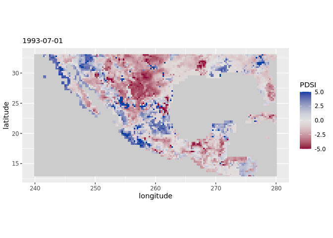<!-- -->

### 1.1. Temporal correlation

The following figure correlates my results against Van der Schrier’s
PDSI time series on a per-pixel basis:

``` r
func_t_cor_map(s_pdsi, vds) -> cor_map

ggplot() +
  geom_stars(data = cor_map) +
  scale_fill_continuous_diverging(palette = "Blue-Red", 
                                  rev = T, 
                                  na.value = "grey80", 
                                  limits = c(-0.95,0.95),
                                  name = "r") +
  coord_fixed()
```

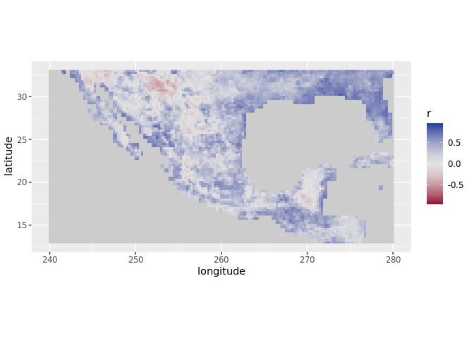<!-- -->

If I randomly choose a pixel with a *high* correlation coefficient, the
time series look like this:

``` r
func_ts_comparison(0.8)
```

<!-- -->

If I choose one with a LOW correlation coefficient:

``` r
func_ts_comparison(0.1)
```

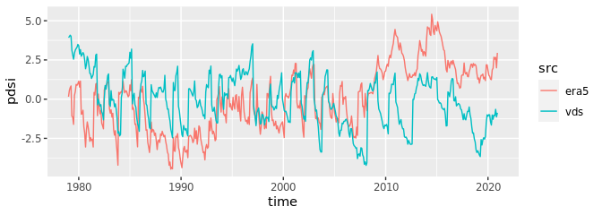<!-- -->

### 1.2. Spatial correlation

The following figure shows correlation coefficients between my results
and Van der Schrier’s PDSI at a month level (i.e. my resulting map at
\_t_n vs. VDS resulting map at \_t_n):

``` r
c(s_pdsi, vds, along = list(foo = c("vds", "era5"))) %>% 
  split("foo") %>% 
  as_tibble() %>% 
  group_by(time) %>% 
  summarize(cor = cor(era5, vds, use = "complete.obs")) -> t_cor 

t_cor %>%   
  ggplot(aes(x = time, y = cor)) +
  geom_point() +
  geom_smooth()
```

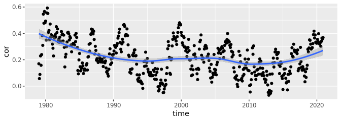<!-- -->

If I randomly choose a date where correlation was *high-ish*, the two
maps look like this:

``` r
func_sp_comparison(0.65)
```

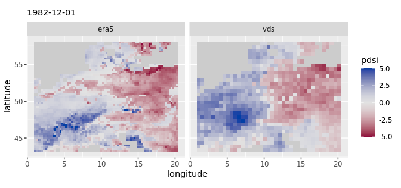<!-- -->

If I choose one where correlation is *low*:

``` r
func_sp_comparison(0.1)
```

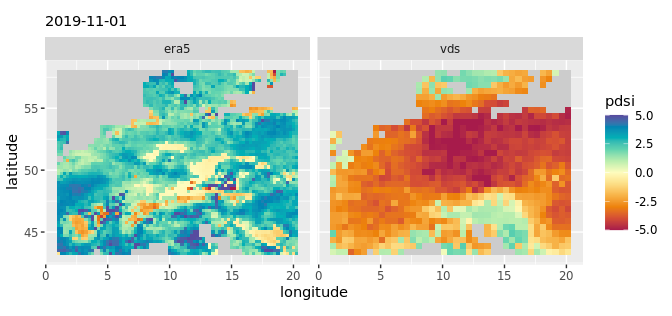<!-- -->

## 2. …with Thornthwaite

Thornthwaite’s PET formulation uses two variables: average temperature
and latitude.

``` r
# calculate pet
var_tave %>% # average temp
  split("time") %>% 
  c(var_lat) %>% # lat
  merge() %>% 
  
  st_apply(c(1,2), function(x){
    
    tail(x, 1) -> lat
    x[1:504] -> x_ts
    
    thornthwaite(Tave = x_ts, 
                 lat = lat)
    
  }, 
  FUTURE = T,
  .fname = "time") %>% 
  st_set_dimensions("time", values = date_vector) %>% 
  aperm(c(2,3,1)) -> pet

# calculate pdsi
c(var_pr, pet, along = 3) %>%
  st_apply(c(1,2), function(x){

    pdsi(P = x[1:504],
         PE = x[505:1008],
         sc = T)$X %>% as.vector()

  },
  FUTURE = T,
  future.seed = NULL,
  .fname = "time") %>%

  st_set_dimensions("time", values = date_vector) %>%
  aperm(c(2,3,1)) -> s_pdsi

c(s_pdsi, mask) %>% 
  mutate(X = ifelse(is.na(m), NA, X)) %>% 
  select(X) -> s_pdsi
```

Mapping a random date:

``` r
sample(date_vector, 1) -> d

ggplot() +
  geom_stars(data = s_pdsi %>% 
               filter(time == d) %>% 
               adrop() %>% 
               mutate(X = case_when(X < -5 ~ -5,
                                    X > 5 ~ 5,
                                    TRUE ~ X))) +
  scale_fill_continuous_diverging(palette = "Blue-Red", 
                                  rev = T, 
                                  na.value = "grey80",
                                  name = "PDSI") +
  coord_fixed() +
  labs(subtitle = d)
```

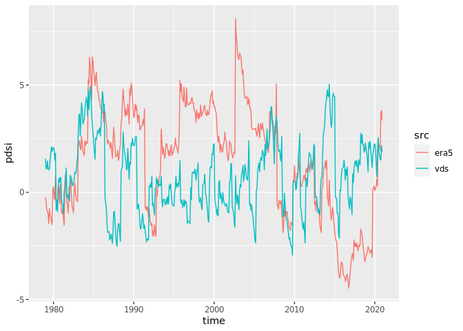<!-- -->

### 2.1. Temporal correlation

When correlating my results using Thornthwaite vs Van der Schrier’s, we
see a drastic improvement over previous results. All cells show positive
correlations, and with high a coefficient:

``` r
func_t_cor_map(s_pdsi, vds) -> cor_map

ggplot() +
  geom_stars(data = cor_map) +
  scale_fill_continuous_diverging(palette = "Blue-Red", 
                                  rev = T, 
                                  na.value = "grey80", 
                                  limits = c(-0.95,0.95),
                                  name = "r") +
  coord_fixed()
```

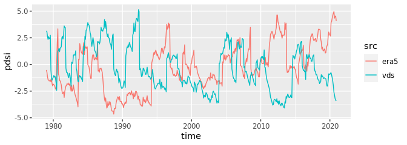<!-- -->

If I randomly choose a pixel with *high* correlation, the time series
look like this:

``` r
func_ts_comparison(0.8) 
```

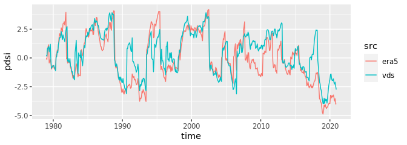<!-- -->

And with *low* correlation:

``` r
func_ts_comparison(0.15)
```

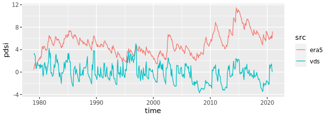<!-- -->

### 2.2. Spatial correlation

Spatially, correlation between my results and Van der Schrier’s
fluctuates around \~0.1 and \~0.7:

``` r
c(s_pdsi, vds, along = list(foo = c("vds", "era5"))) %>% 
  split("foo") %>% 
  as_tibble() %>% 
  group_by(time) %>% 
  summarize(cor = cor(era5, vds, use = "complete.obs")) -> t_cor 

t_cor %>%   
  ggplot(aes(x = time, y = cor)) +
  geom_point() +
  geom_smooth()
```

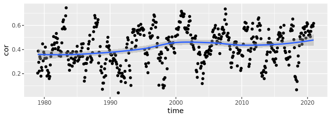<!-- -->

If I randomly choose a date when correlation was *high*:

``` r
func_sp_comparison(0.65)
```

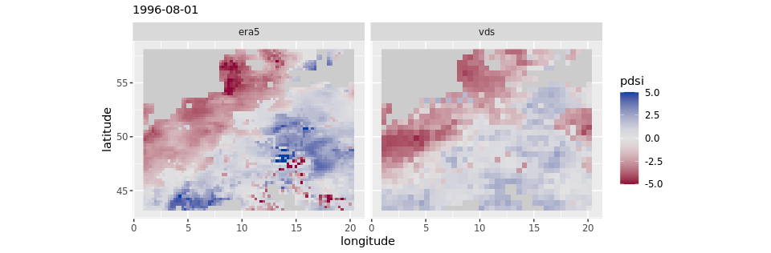<!-- --> And a date
when correlation was *low*:

``` r
func_sp_comparison(0.1)
```

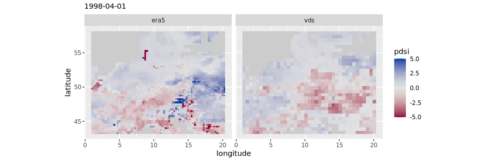<!-- -->

## 3. …with Hargreaves

Hargraves’ PET formulation uses three variables: maximum temperature,
minimum temperature, and radiation.

``` r
# pet
c(var_ra, var_tmax, var_tmin, along = 3) %>%
  st_apply(c(1,2), function(x){
    
    hargreaves(Tmin = x[1009:1512],
               Tmax = x[505:1008],
               Ra = x[1:504],
               na.rm = T)
    
  },
  FUTURE = T,
  .fname = "time") %>% 
  st_set_dimensions("time", values = date_vector) %>% 
  aperm(c(2,3,1)) -> pet

# pdsi
c(var_pr, pet, along = 3) %>% 
  st_apply(c(1,2), function(x){
    
    pdsi(P = x[1:504], 
         PE = x[505:1008], 
         sc = T)$X %>% as.vector()
    
  },
  FUTURE = T,
  future.seed = NULL,
  .fname = "time") %>% 
  
  st_set_dimensions("time", values = date_vector) %>% 
  aperm(c(2,3,1)) -> s_pdsi

c(s_pdsi, mask) %>% 
  mutate(X = ifelse(is.na(m), NA, X)) %>% 
  select(X) -> s_pdsi
```

Mapping a random date:

``` r
sample(date_vector, 1) -> d

ggplot() +
  geom_stars(data = s_pdsi %>% 
               filter(time == d) %>% 
               adrop() %>% 
               mutate(X = case_when(X < -5 ~ -5,
                                    X > 5 ~ 5,
                                    TRUE ~ X))) +
  scale_fill_continuous_diverging(palette = "Blue-Red", 
                                  rev = T, 
                                  na.value = "grey80",
                                  name = "PDSI") +
  coord_fixed() +
  labs(subtitle = d)
```

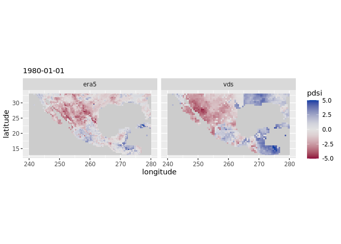<!-- -->

### 3.1. Temporal correlation

Hargraves seem to do worse than Thornthwaite on a per-pixel basis.

``` r
func_t_cor_map(s_pdsi, vds) -> cor_map

ggplot() +
  geom_stars(data = cor_map) +
  scale_fill_continuous_diverging(palette = "Blue-Red", 
                                  rev = T, 
                                  na.value = "grey80", 
                                  limits = c(-0.95,0.95),
                                  name = "r") +
  coord_fixed()
```

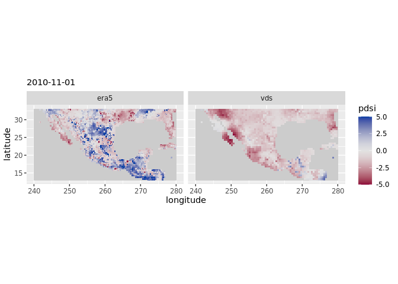<!-- -->

If I randomly choose a pixel with *high* correlation:

``` r
func_ts_comparison(0.8)
```

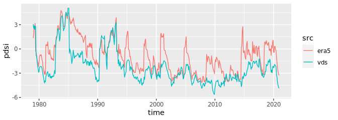<!-- -->

And one with *low* correlation:

``` r
func_ts_comparison(0.1) 
```

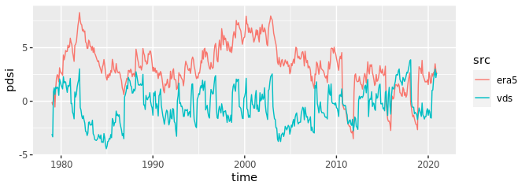<!-- -->

### 3.2. Spatial correlation

Interestingly, the spatial correlation between my results and Van der
Schrier’s show an “arching” trend over time:

``` r
c(s_pdsi, vds, along = list(foo = c("vds", "era5"))) %>% 
  split("foo") %>% 
  as_tibble() %>% 
  group_by(time) %>% 
  summarize(cor = cor(era5, vds, use = "complete.obs")) -> t_cor 

t_cor %>%   
  ggplot(aes(x = time, y = cor)) +
  geom_point() +
  geom_smooth()
```

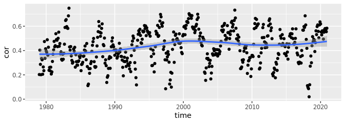<!-- -->

If I randomly choose a date with a *high-ish* correlation it looks like
this:

``` r
func_sp_comparison(0.65)
```

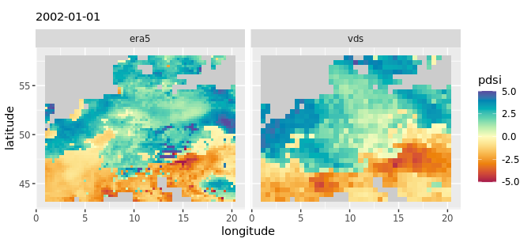<!-- -->

And one with *low* correlation:

``` r
func_sp_comparison(0.1)
```

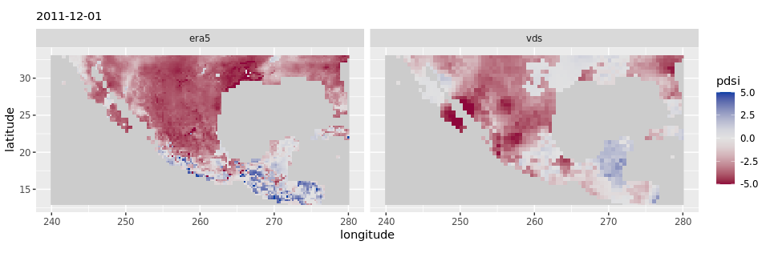<!-- -->

## 4. …with Penman

Penman-Monteith’s PET formulation can include several variables; some
are used to derive others. In this case, I used: maximum temperature,
minimum temperature, wind speed (it should be at 2m but I used at 10m),
external radiance (I used “top of atmosphere”), incoming radiance,
dewpoint temperature (to derive vapor pressure), and surface pressure.

``` r
# pet
source(here::here("scripts", "penman_mod.R"))

c(var_tmin, var_tmax, var_wind, var_ra, var_rs, var_dewpoint, var_pressure, along = 3) -> stack

stack %>% 
  st_apply(c(1,2), function(x){
    
    penman_mod(Tmin = x[1:504],
               Tmax = x[505:1008],
               U2 = x[1009:1512],
               Ra = x[1513:2016],
               Rs = x[2017:2520],
               Tdew = x[2521:3024],
               P = x[3025:3528])
    
  },
  FUTURE = T,
  .fname = "time") %>% 
  st_set_dimensions("time", values = date_vector) %>% 
  aperm(c(2,3,1)) -> pet

# scpdsi
c(var_pr, pet, along = 3) %>% 
  st_apply(c(1,2), function(x){
    
    pdsi(P = x[1:504], 
         PE = x[505:1008], 
         sc = T)$X %>% as.vector()
    
  },
  FUTURE = T,
  future.seed = NULL,
  .fname = "time") %>% 
  
  st_set_dimensions("time", values = date_vector) %>% 
  aperm(c(2,3,1)) -> s_pdsi

c(s_pdsi, mask) %>% 
  mutate(X = ifelse(is.na(m), NA, X)) %>% 
  select(X) -> s_pdsi
```

Mapping a random date:

``` r
sample(date_vector, 1) -> d

ggplot() +
  geom_stars(data = s_pdsi %>% 
               filter(time == d) %>% 
               adrop() %>% 
               mutate(X = case_when(X < -5 ~ -5,
                                    X > 5 ~ 5,
                                    TRUE ~ X))) +
  scale_fill_continuous_diverging(palette = "Blue-Red", 
                                  rev = T, 
                                  na.value = "grey80",
                                  name = "Index") +
  coord_fixed() +
  labs(subtitle = d)
```

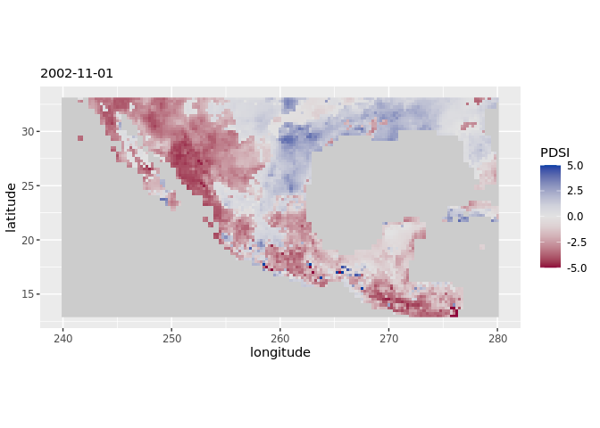<!-- -->

### 4.1. Temporal correlation

Again, we don’t see much improvement over Thornthwaite’s. Similar
spatial patterns and magnitudes of correlation as when using Hargraves.

``` r
func_t_cor_map(s_pdsi, vds) -> cor_map

ggplot() +
  geom_stars(data = cor_map) +
  scale_fill_continuous_diverging(palette = "Blue-Red", 
                                  rev = T, 
                                  na.value = "grey80", 
                                  limits = c(-0.95,0.95),
                                  name = "r") +
  coord_fixed()
```

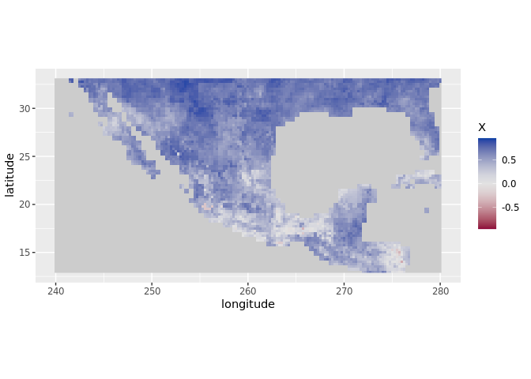<!-- -->

If I randomly choose a pixel with *high* correlation:

``` r
func_ts_comparison(0.8)
```

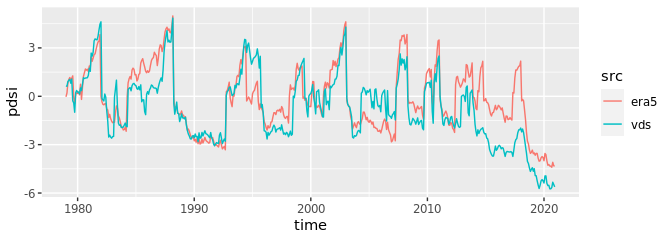<!-- -->

And one with *low* correlation:

``` r
func_ts_comparison(0.1) 
```

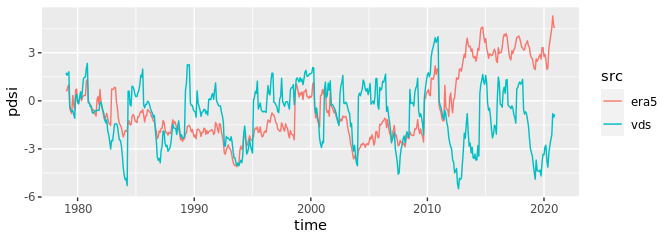<!-- -->

### 4.2. Spatial correlation

Similarly, on a spatial basis, correlations display and “arched” trend
over time.

``` r
c(s_pdsi, vds, along = list(foo = c("era5", "vds"))) %>% 
  split("foo") %>% 
  as_tibble() %>% 
  group_by(time) %>% 
  summarize(cor = cor(era5, vds, use = "complete.obs")) -> t_cor

t_cor %>%   
  ggplot(aes(x = time, y = cor)) +
  geom_point() +
  geom_smooth()
```

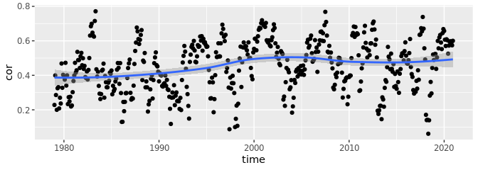<!-- -->

If I randomly choose a date with *high-ish* correlations:

``` r
func_sp_comparison(0.65)
```

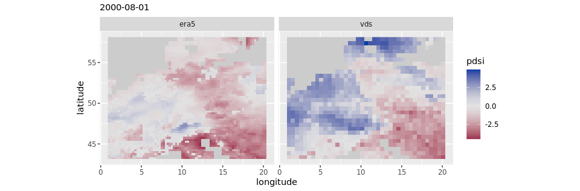<!-- -->

And one with *low* correlations:

``` r
func_sp_comparison(0.1)
```

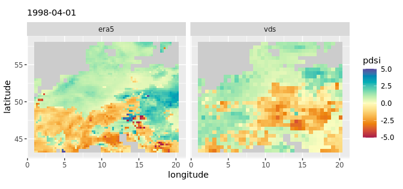<!-- -->

## 5. Penman + elevation

Elevation is an additional variable that can be used to estimate PET
under Penman’s formulation. I used ERA5 geopotential height divided by
the Earth’s gravitational acceleration, g (= 9.80665 m s-2).

``` r
# pet
abind(stack[[1]], var_z[[1]], along = 3) -> stack_array
dim(stack_array) <- c(x = 78, y = 60, time = 3529)

st_as_stars(stack_array) %>% 
  st_apply(c(1,2), function(x){
    
    penman_mod(Tmin = x[1:504],
               Tmax = x[505:1008],
               U2 = x[1009:1512],
               Ra = x[1513:2016],
               Rs = x[2017:2520],
               Tdew = x[2521:3024],
               P = x[3025:3528],
               z = x[3529])
    
  },
  FUTURE = T,
  .fname = "time") %>% 
  aperm(c(2,3,1)) -> pet

st_dimensions(pet) <- st_dimensions(var_tmin)

# scpdsi
c(var_pr, pet, along = 3) %>% 
  st_apply(c(1,2), function(x){
    
    pdsi(P = x[1:504], 
         PE = x[505:1008], 
         sc = T)$X %>% as.vector()
    
  },
  FUTURE = T,
  future.seed = NULL,
  .fname = "time") %>% 
  
  st_set_dimensions("time", values = date_vector) %>% 
  aperm(c(2,3,1)) -> s_pdsi

c(s_pdsi, mask) %>% 
  mutate(X = ifelse(is.na(m), NA, X)) %>% 
  select(X) -> s_pdsi
```

### 5.1. Temporal correlation

Elevation doesn’t seem to improve things on a per-pixel basis…

``` r
func_t_cor_map(s_pdsi, vds) -> cor_map

ggplot() +
  geom_stars(data = cor_map) +
  scale_fill_continuous_diverging(palette = "Blue-Red", 
                                  rev = T, 
                                  na.value = "grey80", 
                                  limits = c(-0.95,0.95),
                                  name = "r") +
  coord_fixed()
```

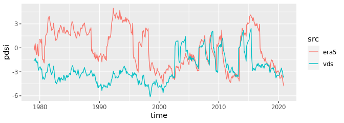<!-- -->

### 5.2. Spatial correlation

And spatially, variability in correlation look very similar…

``` r
c(s_pdsi, vds, along = list(foo = c("era5", "vds"))) %>% 
  split("foo") %>% 
  as_tibble() %>% 
  group_by(time) %>% 
  summarize(cor = cor(era5, vds, use = "complete.obs")) -> t_cor

t_cor %>%   
  ggplot(aes(x = time, y = cor)) +
  geom_point() +
  geom_smooth()
```

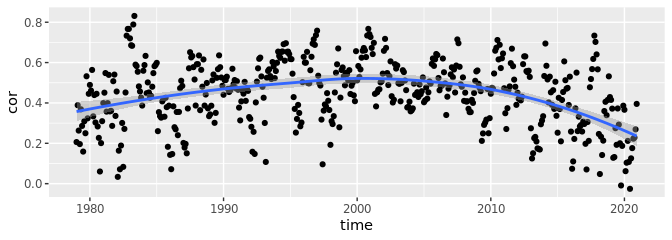<!-- -->

## 6. Penman + elevation + AWC

AWC is a variable required in the calculation of PDSI. I found several
AWC datasets, but all of them are quite complicated to obtain and
process (either antique, bizarre, or proprietary data formats). Before
going through the pain of dealing with this, I ran an experiment to see
to what extent AWC could improve results. The experiment consists of
altering iteratively AWC values for each pixel and choose the one that
gets me “the best” PDSI (i.e. the one with the highest correlation
coefficient with Van der Schrier’s data). While in the former runs AWC
was kept constant (100 mm), here it can have values from 5 to 215.

``` r
func_x <- function(x){
  
  if(sum(!is.na(x[1009:1512])) == 0){
      rep(NA, 506)
     } else{
       
       map_dfr(seq(5, 230, 30), function(awc_i){
         
         pdsi(P = x[1:504], 
              PE = x[505:1008], 
              AWC = awc_i,
              sc = T)$X %>% as.vector() -> pdsi_result
         
         tibble(pdsi = pdsi_result,
                awc = awc_i)
         
       }) -> tb_awc
       
       tb_awc %>% 
         group_by(awc) %>% 
         summarize(r = cor(pdsi, x[1009:1512])) %>% 
         filter(r == max(r, na.rm = T)) %>% 
         slice_sample(n = 1) -> tb_cor
       
       tb_awc %>% 
         filter(awc == tb_cor$awc) %>% 
         pull(pdsi) -> vect_pdsi
       
       # vect_pdsi
       c(vect_pdsi, tb_cor$awc, tb_cor$r)
  
     }
}

# ******

c(var_pr, pet, vds, along = 3) %>%
  
  st_apply(c(1,2),
           func_x,
           FUTURE = T,
           future.seed = NULL,
           .fname = "time") -> s_pdsi

s_pdsi %>% 
  slice(time, 505) -> s_awc

s_pdsi %>% 
  slice(time, 506) -> s_cor

s_pdsi %>%
  slice(time, 1:504) %>% 
  st_set_dimensions("time", values = date_vector) %>% 
  aperm(c(2,3,1)) -> s_pdsi
```

This is how the “artificial” AWC layer looks like. We can see that much
of central Europe was run with low AWC values (\< 50):

``` r
ggplot() +
  geom_stars(data = s_awc) +
  scale_fill_continuous_sequential(palette = "Viridis", 
                                   rev = T, 
                                   na.value = "grey80",
                                   name = "mm") +
  coord_fixed()
```

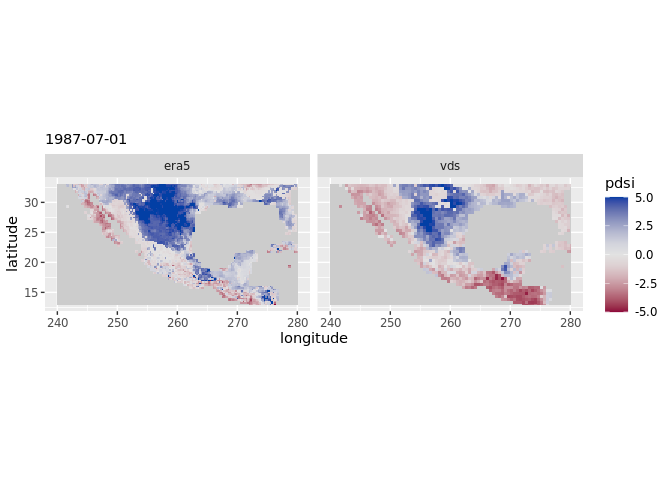<!-- -->

### 6.1. Temporal correlation

Unfortunately, the addition of AWC does not seem to improve results:

``` r
func_t_cor_map(s_pdsi, vds) -> cor_map

ggplot() +
  geom_stars(data = cor_map) +
  scale_fill_continuous_diverging(palette = "Blue-Red", 
                                  rev = T, 
                                  na.value = "grey80", 
                                  limits = c(-0.95,0.95),
                                  name = "r") +
  coord_fixed()
```

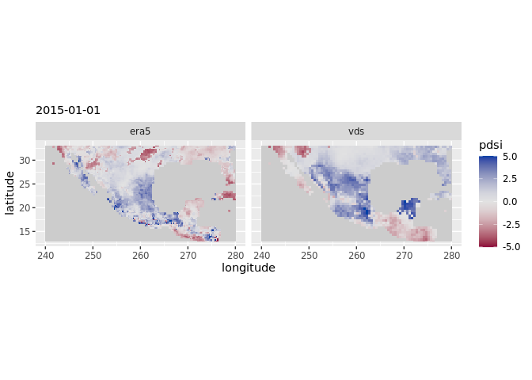<!-- -->

### 6.2. Spatial correlation

And same spatially:

``` r
c(s_pdsi, vds, along = list(foo = c("era5", "vds"))) %>% 
  split("foo") %>% 
  as_tibble() %>% 
  group_by(time) %>% 
  summarize(cor = cor(era5, vds, use = "complete.obs")) -> t_cor

t_cor %>%   
  ggplot(aes(x = time, y = cor)) +
  geom_point() +
  geom_smooth()
```

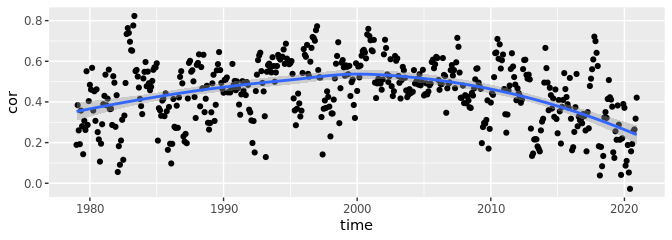<!-- -->
