scPDSI tests
================
Carlos Dobler

Here I show results of a series of test runs for calculating scPDSI with
the R package `scpdsi`. All tests were ran for a region centered on
~~Mexico~~ Central Europe to reduce processing times. Of the variables
that scPDSI asks for, the only ones that would vary were monthly
precipitation and monthly potential evapotranspiration (PET). AWC
remained constant (100 mm), and the start and end dates for calibration
included the whole period. I used four PET formulations: one uses the
“raw” potential evaporation from ERA5 Reanalysis data (no
transpiration); the other three were calculated with the R package
`SPEI` using various ERA5 Reanalysis variables.

### Sections:

scPDSI calculated:  
[1. …with Potential Evaporation (ERA5
data)](#1-with-era5s-potential-evaporation)  
[2. …with Thornthwaite’s formulation](#2-with-thornthwaite)  
[3. …with Hargreaves’ formulation](#3-with-hargreaves)  
[4. …with Penman-Monteith’s formulation](#4-with-penman)

NEW!!!  
[5. …with Penman + elevation](#5-penman--elevation)  
[6. …with Penman + elevation + AWC](#6-penman--elevation--awc)

## 1. …with ERA5’s potential evaporation

Mapping a random date:

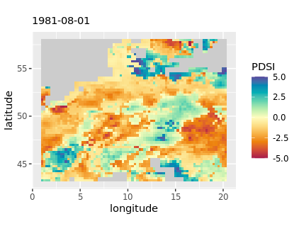

### 1.1. Temporal correlation

The following figure correlates my results against Van der Schrier’s
PDSI time series on a per-pixel basis. Overall, correlation coefficients
are low, with the highest values in the Alps.

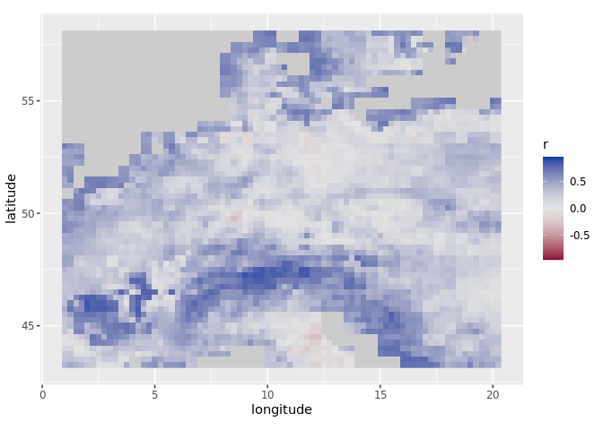

If I randomly choose a pixel with a **high** correlation coefficient (r
= 0.8), its time-series look like this:

If I choose one with a **low** correlation coefficient (r = 0.1):

### 1.2. Spatial correlation

The following figure shows the spatial correlation between my results
and Van der Schrier’s PDSI on a monthly basis (i.e. my resulting map at
t *n* vs. VDS resulting map at t *n*). Correlation coefficients
fluctuate in a “wave-like” form:

If I randomly choose a date when spatial correlation is **high-ish** (r
= 0.65), the two maps look like this:

If I choose one when correlation is **low** (r = 0.1):

## 2. …with Thornthwaite

Thornthwaite’s PET formulation uses two variables: average temperature
and latitude.

Mapping a random date:

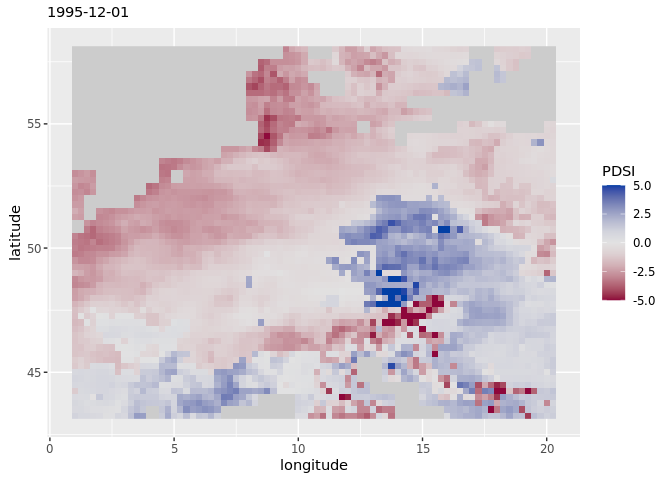

### 2.1. Temporal correlation

Per-pixel correlation of my results based on Thornthwaite vs Van der
Schrier’s shows a drastic improvement over previous results. All cells
show positive correlations, and with high a coefficient. Lowest values
are found over Austria.

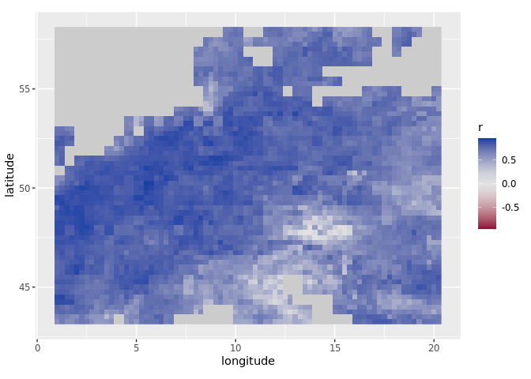

If I randomly choose a pixel with **high** correlation (r = 0.8), the
time series look like this:

And one with **low** correlation (r = 0.15):

### 2.2. Spatial correlation

Spatially, correlation between my results and Van der Schrier’s
fluctuates around \~0.1 and \~0.7, again, in a “wave-like” form:

If I randomly choose a date when correlation was **high-ish** (r = 0.65)
it looks like this:

And a date when correlation was **low** (r = 0.1):

## 3. …with Hargreaves

Hargraves’ PET formulation uses three variables: maximum temperature,
minimum temperature, and radiation.

Mapping a random date:

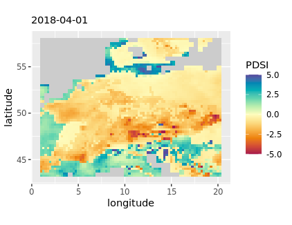

### 3.1. Temporal correlation

Hargraves seem to do worse than Thornthwaite on a per-pixel basis.
Correlation coefficients decline in general, and in some small areas are
now slightly negative. Highest values are in the west Balkans and
southern Alps.

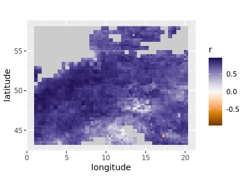

If I randomly choose a pixel with **high** correlation (r = 0.8), its
time-series looks like this:

And one with **low** correlation (r = 0.1):

### 3.2. Spatial correlation

Interestingly, the spatial correlation between my results and Van der
Schrier’s show an “arching” trend over time, with its “peak” around
2000:

If I randomly choose a date with a **high-ish** correlation (r = 0.65)
it looks like this:

And one with **low** correlation (r = 0.1):

## 4. …with Penman

Penman-Monteith’s PET formulation can include several variables; some
are used to derive others. In this case, I used: maximum temperature,
minimum temperature, wind speed (it should be at 2m but I used at 10m),
external radiance (I used “top of atmosphere”), incoming radiance,
dewpoint temperature (to derive vapor pressure), and surface pressure.

Mapping a random date:

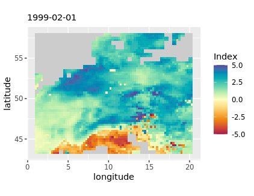

### 4.1. Temporal correlation

Again, we don’t see much improvement over Thornthwaite’s. Spatial
patterns and magnitudes of correlation are **extremely** similar as when
using Hargreaves:

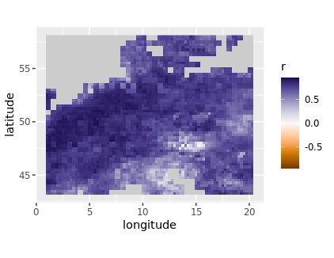

If I randomly choose a pixel with **high** correlation (r = 0.8):

And one with **low** correlation (r = 0.1):

### 4.2. Spatial correlation

Similarly, on a spatial basis, correlations display an “arched” trend
over time:

If I randomly choose a date with **high-ish** correlations (r = 0.65):

And one with **low** correlations (r = 0.1):

## 5. Penman + elevation

Elevation is an additional variable that can be used to estimate PET
under the Penman-Monteith formulation. I used ERA5 geopotential height
divided by the Earth’s gravitational acceleration, g (= 9.80665 m s-2).

### 5.1. Temporal correlation

Elevation doesn’t seem to improve things on a per-pixel basis:

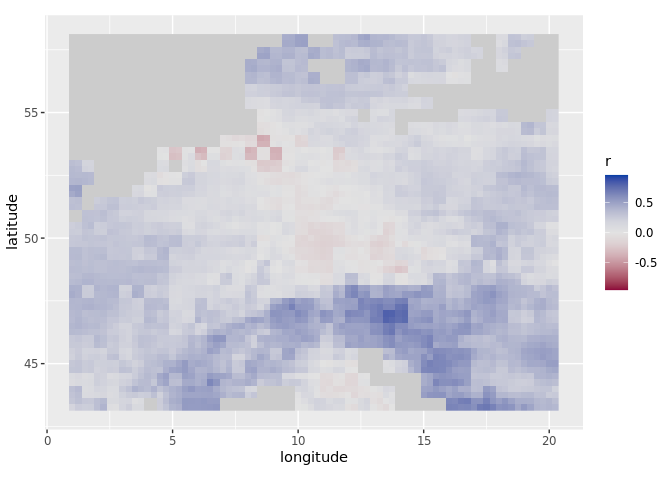

### 5.2. Spatial correlation

And spatially, variability in correlation coefficients looks very
similar as when I was **not** using elevation:

## 6. Penman + elevation + AWC

AWC is a variable required in the calculation of PDSI. I found several
AWC datasets, but all of them are quite complicated to obtain and
process (they are distributed in either antique, bizarre, or proprietary
data formats). Before going through the pain of dealing with this, I ran
an experiment to see to what extent AWC could improve results. The
experiment consists of altering AWC values iteratively for each pixel
and choose the one that gets me “the best” PDSI (i.e. the one that
correlates the most with Van der Schrier). Thus, while in the former
runs AWC was kept constant (100 mm), here it can have values from 5 to
215 mm.

This is how the “artificial” AWC layer looks like. We can see that in
much of central Europe, the “best” PDSI was obtained when AWC values
were low (\< 50 mm):

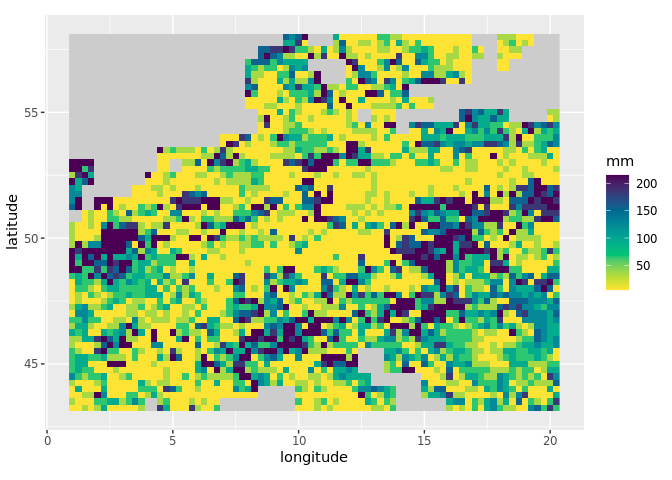

### 6.1. Temporal correlation

Unfortunately, AWC variability does not seem to improve results:

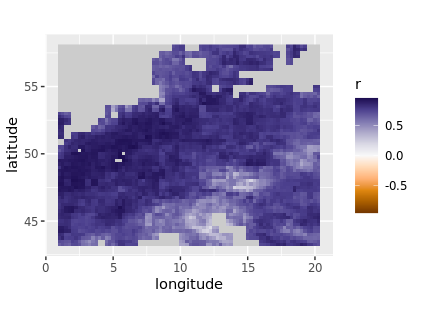

### 6.2. Spatial correlation

And same spatially:

