scPDSI tests
================
Carlos Dobler

Here I show results of a series of test runs for calculating scPDSI with
the R package `scpdsi`. All tests were ran for a region centered on
Mexico to reduce processing times. Of the variables that scPDSI asks
for, the only ones that would vary were monthly precipitation and
monthly potential evapotranspiration (PET). AWC remained constant (100
mm), and the start and end dates for calibration included the whole
period. I used four PET formulations: one uses the “raw” potential
evaporation from ERA5 Reanalysis data; the other three were calculated
with the R package `SPEI` using various ERA5 Reanalysis variables.

### Sections:

scPDSI calculated: [1. …with Potential Evaporation (ERA5
data)](#1-with-era5s-potential-evaporation)  
[2. …with Thornthwaite’s formulation](#2-with-thornthwaite) [3. …with
Hargreaves’ formulation](#3-with-hargreaves) [4. …with Penman-Monteith’s
formulation](#4-with-penman)

## 1. …with ERA5’s potential evaporation

``` r
c(var_pr, var_potev, along = 3) %>% 
  st_apply(c(1,2), function(x){
    
    pdsi(P = x[1:504], 
         PE = x[505:1008], 
         sc = T)$X %>% as.vector()
    
  },
  FUTURE = T,
  future.seed = NULL,
  .fname = "time") %>% 
  st_set_dimensions("time", values = date_vector) %>% 
  aperm(c(2,3,1)) -> s_pdsi

s_pdsi[is.na(adrop(vds[,,,1]))] <- NA
```

Mapping a random date:

``` r
sample(date_vector, 1) -> d

ggplot() +
  geom_stars(data = s_pdsi %>% 
               filter(time == d) %>% 
               adrop() %>% 
               mutate(X = case_when(X < -5 ~ -5,
                                    X > 5 ~ 5,
                                    TRUE ~ X))) +
  scale_fill_continuous_diverging(palette = "Blue-Red", 
                                  rev = T, 
                                  na.value = "grey80",
                                  name = "PDSI"
                                  ) +
  coord_fixed() +
  labs(subtitle = d)
```

<!-- -->

### 1.1. Temporal correlation

The following figure correlates my results against Van der Schrier’s
PDSI time series on a per-pixel basis. Overall, correlation values are
low, and in some regions (e.g. Arizona) are negative.

``` r
func_t_cor_map <- function(era_map, vds_map){
  
  c(era_map, vds_map, along = 3) %>% 
  st_apply(c(1,2), function(x){
    
    cor(x[1:504], x[505:1008])
    
  }, 
  FUTURE = T)
}

func_t_cor_map(s_pdsi, vds) -> cor_map

ggplot() +
  geom_stars(data = cor_map) +
  scale_fill_continuous_diverging(palette = "Blue-Red", 
                                  rev = T, 
                                  na.value = "grey80", 
                                  limits = c(-0.95,0.95),
                                  name = "r") +
  coord_fixed()
```

<!-- -->

If I randomly choose a pixel with a HIGH correlation coefficient, the
time series look like this:

``` r
func_ts_comparison <- function(thres){
  
  cor_map %>% 
    as_tibble() %>% 
    filter(near(X, thres, 0.01)) %>% 
    slice_sample(n = 1) %>% 
    {c(.$longitude, .$latitude)} -> coords
  
  vds %>%
    as_tibble() %>% 
    filter(longitude == coords[1],
           latitude == coords[2]) %>% 
    pull(scpdsi) -> vect_vds

  s_pdsi %>% 
    as_tibble() %>% 
    filter(longitude == coords[1],
           latitude == coords[2]) %>% 
    pull(X) -> vect_era

  tibble(vds = vect_vds,
         era5 = vect_era,
         time = date_vector) %>% 
    pivot_longer(-time, names_to = "src", values_to = "pdsi") %>% 
    
    ggplot(aes(x = time, y = pdsi, color = src)) +
    geom_line()
  
}

func_ts_comparison(0.8)
```

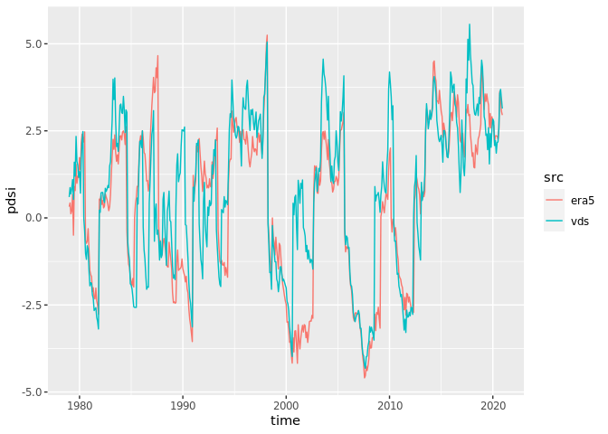<!-- -->

If I choose one with a LOW correlation coefficient:

``` r
func_ts_comparison(0.1)
```

<!-- -->

If I choose one with a NEGATIVE correlation coefficient:

``` r
func_ts_comparison(-0.3)
```

<!-- -->

### 1.2. Spatial correlation

The following figure shows correlation coefficients between my results
and Van der Schrier’s PDSI at a month level (i.e. my resulting map at
t-n vs. VDS resulting map at t-n). We can see that correlation
fluctuates over time, between a coefficient of \~0 and \~0.5.

``` r
c(s_pdsi, vds, along = list(foo = c("vds", "era5"))) %>% 
  split("foo") %>% 
  as_tibble() %>% 
  group_by(time) %>% 
  summarize(cor = cor(era5, vds, use = "complete.obs")) -> t_cor 

t_cor %>%   
  ggplot(aes(x = time, y = cor)) +
  geom_point() +
  geom_smooth()
```

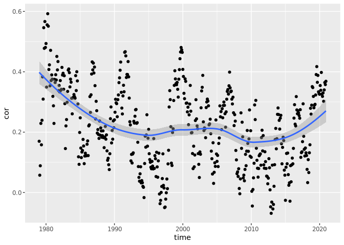<!-- -->

If I randomly choose a date where correlation was HIGH-ish, the two maps
look like this:

``` r
func_sp_comparison <- function(thres){
  
  t_cor %>% 
    as_tibble() %>% 
    filter(near(cor, thres, 0.01)) %>% 
    slice_sample(n = 1) %>% 
    pull(time) -> t_time
  
  s_pdsi %>%
    filter(time == t_time) %>% 
    adrop() %>% 
    as_tibble() -> m_1
  
  vds %>%
    filter(time == t_time) %>% 
    adrop() %>% 
    as_tibble() -> m_2
  
  left_join(m_1, m_2, by = c("longitude", "latitude")) %>%
    rename(era5 = 3,
           vds = 4) %>% 
    pivot_longer(3:4, names_to = "src", values_to = "pdsi") %>% 
    mutate(pdsi = case_when(pdsi < -5 ~ -5,
                            pdsi > 5 ~ 5,
                            TRUE ~ pdsi)) %>% 
    ggplot(aes(x = longitude, y = latitude, fill = pdsi)) +
    geom_raster() +
    scale_fill_continuous_diverging(palette = "Blue-Red", rev = T, na.value = "grey80") +
    facet_wrap(~src, ncol = 2) +
    coord_equal() +
    labs(subtitle = t_time)
  
}

func_sp_comparison(0.5)
```

<!-- -->

If I choose one where correlation is LOW:

``` r
func_sp_comparison(0.1)
```

<!-- -->

## 2. …with Thornthwaite

Thornthwaite’s PET formulation uses two variables: average temperature
and latitude.

``` r
# calculate pet
var_tave %>% # average temp
  split("time") %>% 
  c(var_lat) %>% # lat
  merge() %>% 
  
  st_apply(c(1,2), function(x){
    
    x[length(x)] -> lat
    x[-length(x)] -> x_ts
    
    thornthwaite(Tave = x_ts, 
                 lat = lat)
    
  }, 
  FUTURE = T,
  .fname = "time") %>% 
  st_set_dimensions("time", values = date_vector) %>% 
  aperm(c(2,3,1)) -> pet

# calculate pdsi
c(var_pr, pet, along = 3) %>% 
  st_apply(c(1,2), function(x){
    
    pdsi(P = x[1:504], 
         PE = x[505:1008], 
         sc = T)$X %>% as.vector()
    
  },
  FUTURE = T,
  future.seed = NULL,
  .fname = "time") %>% 
  
  st_set_dimensions("time", values = date_vector) %>% 
  aperm(c(2,3,1)) -> s_pdsi
```

Mapping a random date:

``` r
s_pdsi[is.na(adrop(vds[,,,1]))] <- NA

sample(date_vector, 1) -> d

ggplot() +
  geom_stars(data = s_pdsi %>% 
               filter(time == d) %>% 
               adrop() %>% 
               mutate(X = case_when(X < -5 ~ -5,
                                    X > 5 ~ 5,
                                    TRUE ~ X))) +
  scale_fill_continuous_diverging(palette = "Blue-Red", 
                                  rev = T, 
                                  na.value = "grey80",
                                  name = "PDSI") +
  coord_fixed() +
  labs(subtitle = d)
```

<!-- -->

### 2.1. Temporal correlation

When correlating my results using Thornthwaite vs Van der Schrier’s, we
see an improvement over previous results. Almost all cells show positive
correlations, although they tend to be quite low in the south-east of
Mexico.

``` r
func_t_cor_map(s_pdsi, vds) -> cor_map

ggplot() +
  geom_stars(data = cor_map) +
  scale_fill_continuous_diverging(palette = "Blue-Red", 
                                  rev = T, 
                                  na.value = "grey80", 
                                  limits = c(-0.95,0.95),
                                  name = "r") +
  coord_fixed()
```

<!-- -->

If I randomly choose a pixel with HIGH correlation, the time series look
like this:

``` r
func_ts_comparison(0.8) 
```

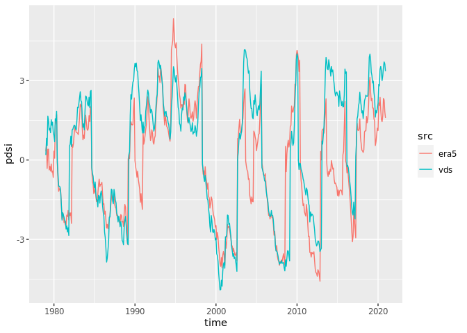<!-- -->

And with LOW correlation:

``` r
func_ts_comparison(0.1)
```

<!-- -->

### 2.2. Spatial correlation

Spatially, correlation between my results and Van der Schrier’s
fluctuates around \~0.1 and \~0.6:

``` r
c(s_pdsi, vds, along = list(foo = c("vds", "era5"))) %>% 
  split("foo") %>% 
  as_tibble() %>% 
  group_by(time) %>% 
  summarize(cor = cor(era5, vds, use = "complete.obs")) -> t_cor 

t_cor %>%   
  ggplot(aes(x = time, y = cor)) +
  geom_point() +
  geom_smooth()
```

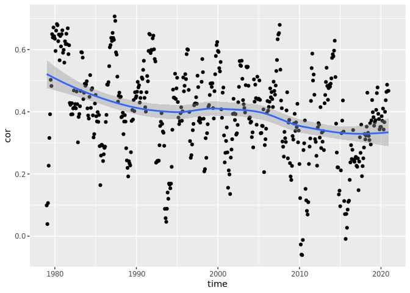<!-- -->

If I randomly choose a date where correlation was HIGH:

``` r
func_sp_comparison(0.6)
```

<!-- --> And a
date where correlation was LOW:

``` r
func_sp_comparison(0.1)
```

<!-- -->

## 3. …with Hargreaves

Hargraves’ PET formulation uses three variables: maximum temperature,
minimum temperature, and radiation.

``` r
# pet
c(var_ra, var_tmax, var_tmin) %>%
  st_apply(c(1,2), function(x){
    
    hargreaves(Tmin = x[1009:1512],
               Tmax = x[505:1008],
               Ra = x[1:504],
               na.rm = T)
    
  },
  FUTURE = T,
  .fname = "time") %>% 
  st_set_dimensions("time", values = date_vector) %>% 
  aperm(c(2,3,1)) -> pet

# pdsi
c(var_pr, pet, along = 3) %>% 
  st_apply(c(1,2), function(x){
    
    pdsi(P = x[1:504], 
         PE = x[505:1008], 
         sc = T)$X %>% as.vector()
    
  },
  FUTURE = T,
  future.seed = NULL,
  .fname = "time") %>% 
  
  st_set_dimensions("time", values = date_vector) %>% 
  aperm(c(2,3,1)) -> s_pdsi
```

Mapping a random date:

``` r
s_pdsi[is.na(adrop(vds[,,,1]))] <- NA

sample(date_vector, 1) -> d

ggplot() +
  geom_stars(data = s_pdsi %>% 
               filter(time == d) %>% 
               adrop() %>% 
               mutate(X = case_when(X < -5 ~ -5,
                                    X > 5 ~ 5,
                                    TRUE ~ X))) +
  scale_fill_continuous_diverging(palette = "Blue-Red", 
                                  rev = T, 
                                  na.value = "grey80",
                                  name = "PDSI") +
  coord_fixed() +
  labs(subtitle = d)
```

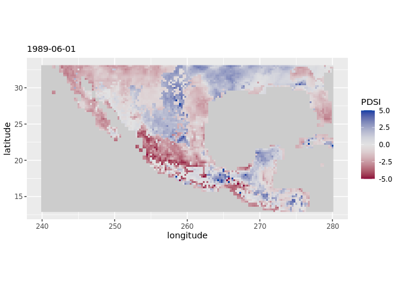<!-- -->

### 3.1. Temporal correlation

Using Hargraves doesn’t seem to improve much the correlation compared to
those obtained using Thorthwaite. Most pixels show positive correlation,
but again, values in the south-east tend to be low.

``` r
func_t_cor_map(s_pdsi, vds) -> cor_map

ggplot() +
  geom_stars(data = cor_map) +
  scale_fill_continuous_diverging(palette = "Blue-Red", 
                                  rev = T, 
                                  na.value = "grey80", 
                                  limits = c(-0.95,0.95),
                                  name = "r") +
  coord_fixed()
```

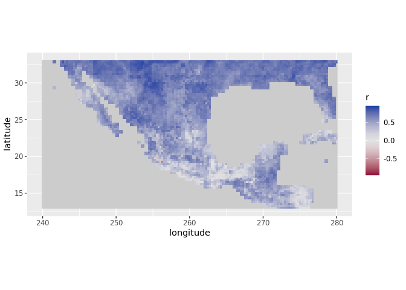<!-- -->

If I randomly choose a pixel with HIGH correlation:

``` r
func_ts_comparison(0.8) 
```

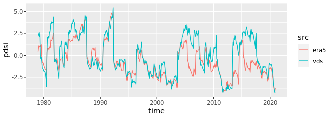<!-- -->

And one with LOW correlation:

``` r
func_ts_comparison(0.1) 
```

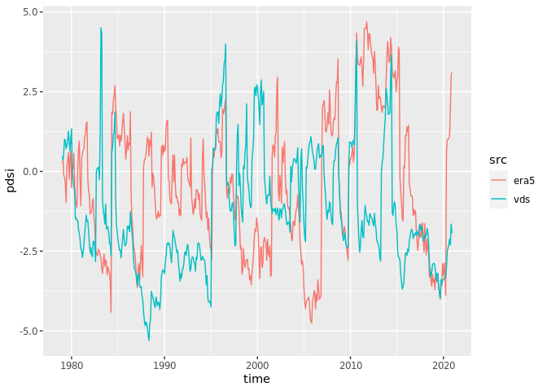<!-- -->

### 3.2. Spatial correlation

Interestingly, spatial correlation between my results and Van der
Schrier’s shows a downward trend over time.

``` r
c(s_pdsi, vds, along = list(foo = c("vds", "era5"))) %>% 
  split("foo") %>% 
  as_tibble() %>% 
  group_by(time) %>% 
  summarize(cor = cor(era5, vds, use = "complete.obs")) -> t_cor 

t_cor %>%   
  ggplot(aes(x = time, y = cor)) +
  geom_point() +
  geom_smooth()
```

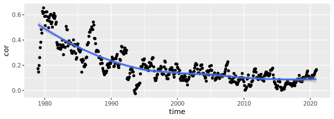<!-- -->

If I randomly choose a date with a HIGH-ish correlation:

``` r
func_sp_comparison(0.55)
```

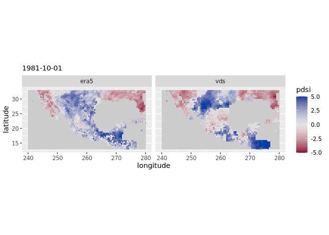<!-- -->

And one with LOW correlation:

``` r
func_sp_comparison(0.1)
```

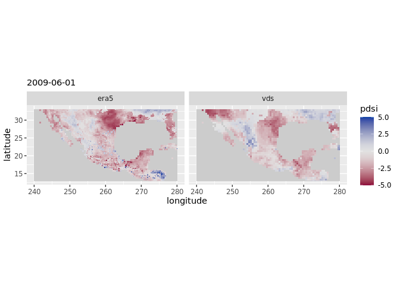<!-- -->

## 4. …with Penman

Penman-Monteith’s PET formulation can include several variables; some
are used to derive others. In this case, I used: maximum temperature,
minimum temperature, wind speed (it should be at 2m but I used at 10m),
external radiance (I used “top of atmosphere”), incoming radiance,
dewpoint temperature (to derive vapor pressure), and surface pressure.
The function recommends to include elevation, something I’ll try later.

``` r
# pet
source(here::here("scripts", "penman_mod.R"))

c(var_tmin, var_tmax, var_u10, var_ra, var_rs, var_dewptemp, var_pres, along = 3) %>%
  st_apply(c(1,2), function(x){
    
    penman_mod(Tmin = x[1:504],
           Tmax = x[505:1008],
           U2 = x[1009:1512],
           Ra = x[1513:2016],
           Rs = x[2017:2520],
           Tdew = x[2521:3024],
           P = x[3025:3528])
    
  },
  FUTURE = T,
  .fname = "time") %>% 
  st_set_dimensions("time", values = date_vector) %>% 
  aperm(c(2,3,1)) -> pet

# pdsi
c(var_pr, pet, along = 3) %>% 
  st_apply(c(1,2), function(x){
    
    pdsi(P = x[1:504], 
         PE = x[505:1008], 
         sc = T)$X %>% as.vector()
    
  },
  FUTURE = T,
  future.seed = NULL,
  .fname = "time") %>% 
  
  st_set_dimensions("time", values = date_vector) %>% 
  aperm(c(2,3,1)) -> s_pdsi
```

Mapping a random date:

``` r
s_pdsi[is.na(adrop(vds[,,,1]))] <- NA

sample(date_vector, 1) -> d

ggplot() +
  geom_stars(data = s_pdsi %>% 
               filter(time == d) %>% 
               adrop() %>% 
               mutate(X = case_when(X < -5 ~ -5,
                                    X > 5 ~ 5,
                                    TRUE ~ X))) +
  scale_fill_continuous_diverging(palette = "Blue-Red", 
                                  rev = T, 
                                  na.value = "grey80",
                                  name = "Index") +
  coord_fixed() +
  labs(subtitle = d)
```

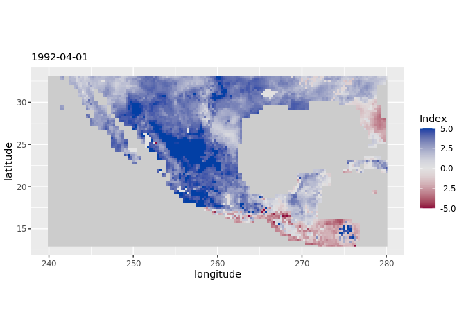<!-- -->

### 4.1. Temporal correlation

Again, we don’t see much improvement. Similar spatial patterns and
magnitudes of correlation as when using Thornthwaite and Hargraves.

``` r
func_t_cor_map(s_pdsi, vds) -> cor_map

ggplot() +
  geom_stars(data = cor_map) +
  scale_fill_continuous_diverging(palette = "Blue-Red", 
                                  rev = T, 
                                  na.value = "grey80", 
                                  limits = c(-0.95,0.95)) +
  coord_fixed()
```

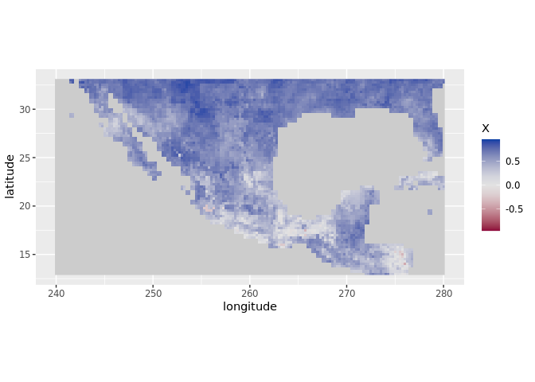<!-- -->

If I randomly choose a pixel with HIGH correlation:

``` r
func_ts_comparison(0.8)
```

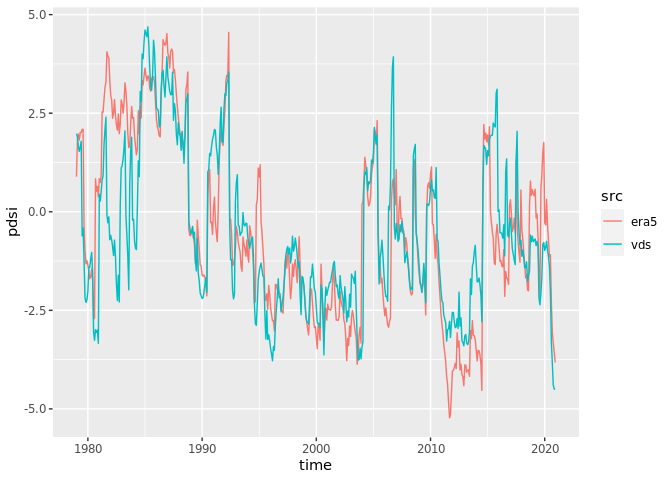<!-- -->

And one with LOW correlation:

``` r
func_ts_comparison(0.1) 
```

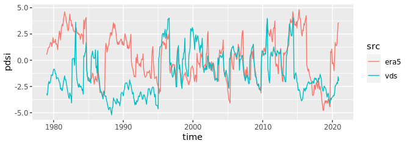<!-- -->

### 4.2. Spatial correlation

Here we see a drastic decline of spatial correlations over time.

``` r
c(s_pdsi, vds, along = list(foo = c("era5", "vds"))) %>% 
  split("foo") %>% 
  as_tibble() %>% 
  group_by(time) %>% 
  summarize(cor = cor(era5, vds, use = "complete.obs")) -> t_cor

t_cor %>%   
  ggplot(aes(x = time, y = cor)) +
  geom_point() +
  geom_smooth()
```

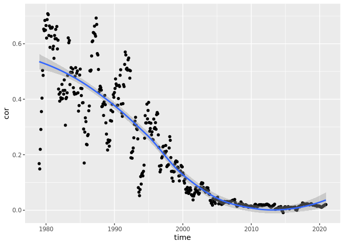<!-- -->

If I randomly choose a date with HIGH-ish correlations:

``` r
func_sp_comparison(0.6)
```

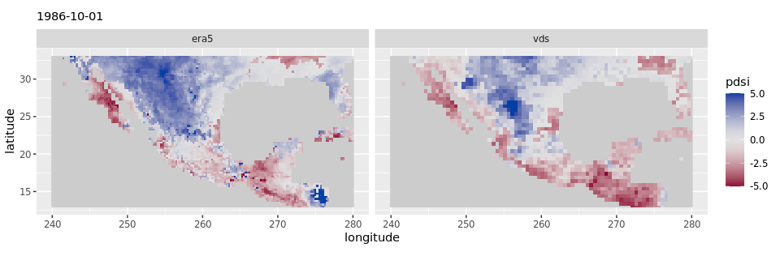<!-- -->

And one with LOW correlations:

``` r
func_sp_comparison(0.1)
```

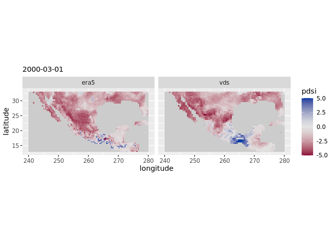<!-- -->
