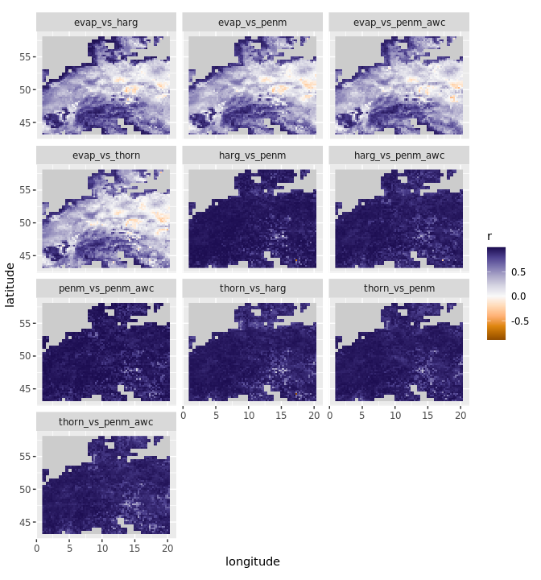
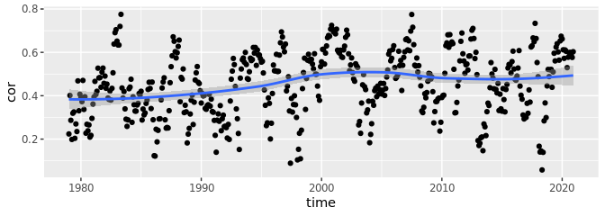
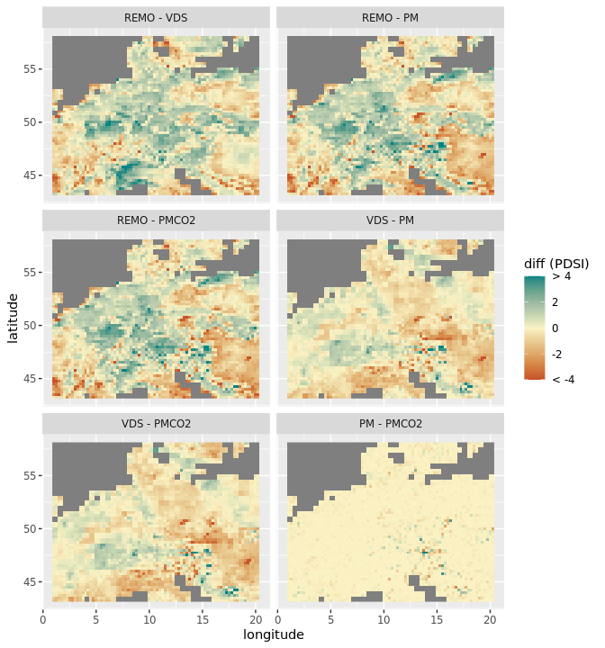
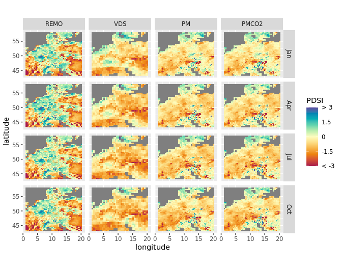
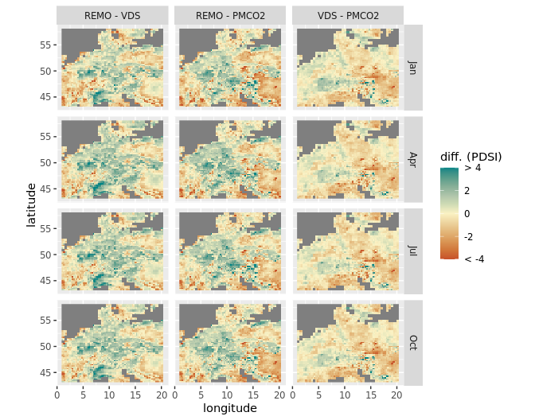

scPDSI tests
================
Carlos Dobler

Here I show results of a series of test runs for calculating scPDSI with
the R package `scpdsi`. All tests were ran for a region centered on
~~Mexico~~ Central Europe to reduce processing times. Of the variables
that scPDSI asks for, the only ones that would vary were monthly
precipitation and monthly potential evapotranspiration (PET). AWC
remained constant (100 mm), and the start and end dates for calibration
included the whole period (1979-2020). I used four PET formulations: one
uses the “raw” potential evaporation from ERA5 Reanalysis data (no
transpiration); the other three were calculated with the R package
`SPEI` using various ERA5 Reanalysis variables.

### Sections:

scPDSI calculated:  
[1. …with ERA5’s Potential
Evaporation](#1-pdsi-with-era5s-potential-evaporation)  
[2. …with Thornthwaite’s
formulation](#2-pdsi-with-thornthwaites-pet-formulation)  
[3. …with Hargreaves’
formulation](#3-pdsi-with-hargreaves-pet-formulation)  
[4. …with Penman-Monteith’s
formulation](#4-pdsi-with-penman-monteiths-pet-formulation)  
[5. …with Penman-M + AWC](#5-pdsi-with-penman-m--awc)

NEW!!!  
[6. …with Penman-M + CO2 adjustment](#6-penman-m-with-co2-adjustment)  
[7. Comparison with
REMO](#8-remo-vs-penman-no-co2-adj-vs-penman-w-co2-adj-vs-van-der-schrier)

## 1. PDSI with ERA5’s potential evaporation

Map of a random date:

### 1.1. Temporal correlation

The following figure correlates my results against van der Schrier’s on
a per-pixel basis (i.e. time-series vs time-series). Overall,
correlation coefficients are low, with the highest values in the Alps.

If I randomly choose a pixel with a **high** correlation coefficient (r
= 0.8), its time-series look like this:

If I choose one with a **low** correlation coefficient (r = 0.15):

### 1.2. Spatial correlation

The following figure shows the spatial correlation between my results
and van der Schrier’s on a monthly basis (i.e. my resulting map at t*n*
vs. VDS at t*n*). We can see correlation coefficients fluctuate in a
“wave-like” form:

If I randomly choose a date with **high-ish** spatial correlation (r =
0.65), the two maps look like this:

If I choose one with **low** correlation (r = 0.1):

## 2. PDSI with Thornthwaite’s PET formulation

Thornthwaite’s PET formulation uses two variables: average temperature
and latitude.

Map of a random date:

### 2.1. Temporal correlation

Per-pixel correlation of my results based on Thornthwaite vs van der
Schrier’s shows a drastic improvement over previous results. All cells
show positive correlations, and with high coefficients. Lowest values
are found over Austria.

If I randomly choose a pixel with **high** correlation (r = 0.8), its
time-series look like this:

And one with **low** correlation (r = 0.15):

### 2.2. Spatial correlation

Spatially, correlation between my results and van der Schrier’s
fluctuates around \~0.1 and \~0.7, again, in a “wave-like” form:

If I randomly choose a date when correlation was **high-ish** (r = 0.65)
it looks like this:

And a date when correlation was **low** (r = 0.1):

## 3. PDSI with Hargreaves’ PET formulation

Hargraves’ PET formulation uses three variables: maximum temperature,
minimum temperature, and radiation.

Map of a random date:

### 3.1. Temporal correlation

PDSI calculated with Hargreaves produces very similar results than when
using Thornthwaite on a per-pixel basis:

If I randomly choose a pixel with **high** correlation (r = 0.8), its
time-series looks like this:

And one with **low** correlation (r = 0.1):

### 3.2. Spatial correlation

Similarly, the spatial correlation between my results and van der
Schrier’s show a “wave-like” trend over time:

If I randomly choose a date with a **high-ish** correlation (r = 0.65)
it looks like this:

And one with **low** correlation (r = 0.1):

## 4. PDSI with Penman-Monteith’s PET formulation

Penman-Monteith’s PET formulation can include several variables; some
are used to derive others. In this case, I used: maximum temperature,
minimum temperature, wind speed (it should be at 2m but I used at 10m),
external radiance (I used “top of atmosphere”), incoming radiance,
dewpoint temperature (to derive vapor pressure), surface pressure, and
elevation (I used ERA5 geopotential height divided by the Earth’s
gravitational acceleration, g = 9.8 m/s).

Map of a random date:

### 4.1. Temporal correlation

Correlation coefficients on a per-pixel basis are very similar to those
obtained with Hargreaves’ and Thornthwaite’s PET formulations:

If I randomly choose a pixel with **high** correlation (r = 0.8):

And one with **low** correlation (r = 0.1):

### 4.2. Spatial correlation

The spatial correlation trend also looks very similar to previous
results, albeit with a slight increase over time:

If I randomly choose a date with **high-ish** correlations (r = 0.65):

And one with **low** correlations (r = 0.1):

## 5. PDSI with Penman-M + AWC

AWC is a variable required in the calculation of PDSI. I found several
AWC datasets, but all of them are quite complicated to obtain and
process (they are distributed in either antique, bizarre, or proprietary
data formats). Before going through the pain of dealing with this, I ran
an experiment to see to what extent AWC could improve results. The
experiment consists of altering AWC values iteratively for each pixel
and choose the one that gets me “the best” PDSI (i.e. the one that
correlates the highest with van der Schrier). Thus, while in the former
runs AWC was kept constant (100 mm), here it can have values from 5 to
215 mm for each pixel.

This is how the “artificial” AWC layer looks like:

### 5.1. Temporal correlation

Unfortunately, the incorporation of AWC does not seem to change results
in a substantial way:

### 5.2. Spatial correlation

And same spatially:

*How do all previous results compare (i.e. correlate) to each other?*
With the exception of those obtained with ERA5’s potential evaporation
(section 1), the rest of the results correlate extremely well with each
other - in other words, they are **almost** the same.

## 6. Penman-M with CO2 adjustment

Here I incorporated the CO2 adjustment into Penman-M’s PET formulation
following [Yang et al. 2019](https://doi.org/10.1038/s41558-018-0361-0)

### 7.1. Temporal correlation

Results show a similar pattern of temporal correlation with van der
Schrier than previous results:

### 7.2. Spatial correlation

Same for spatial correlation:

## 8. REMO vs. Penman (no CO2 adj.) vs. Penman (w/ CO2 adj.) vs. van der Schrier

In this section I compare some of my previous results with REMO 2015
data. In order to compare, I sliced everything temporally so that it
would correspond to +1 degree world.

### 8.1. Mean annual comparisons

This figure shows mean annual scPDSI maps for different models. REMO
diverges considerably from the others:

Differences can better be appreciated in the following figure, which
compares (substracts) mean annual scPDSI between pairs of models:

### 8.2. Mean seasonal cycle comparisons

The following figure shows mean monthly scPDSI maps for different
models. Again, we see REMO diverges considerably from the others.

Note: I kept scratching my head and checked my script several times in
an attempt to figure out why the differences **between months** were so
small (i.e. for a given model, months look almost the same). I think the
answer is related to temporal autocorrelation - meaning, drought in a
given month is influenced by the previous month. From one month to
another, PDSI will look very similar. When I average all 21 months of
the +1 deg period, these similarities propagate, reducing the
differences between months.

This figure shows differences in PDSI between different models for
different months (PM without CO2 adjustment is not shown here as we have
seen it’s essentially the same as the one with adjustment).

