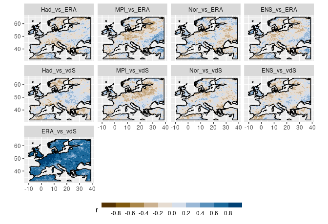
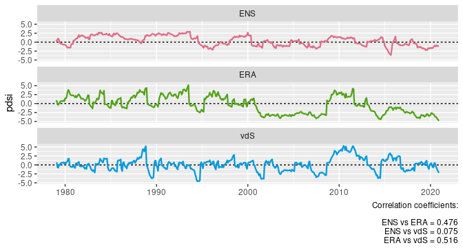
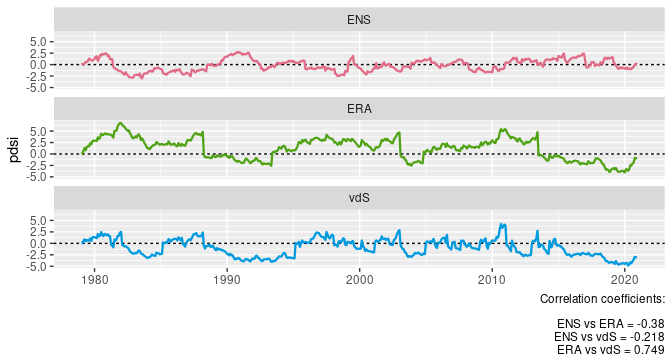
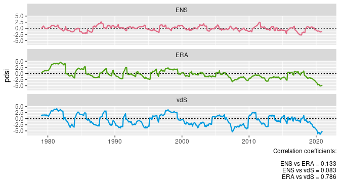
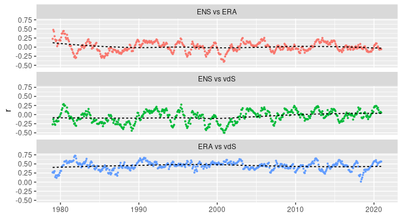
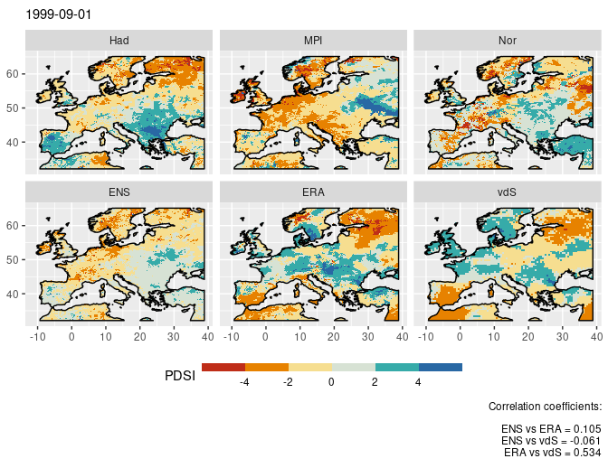
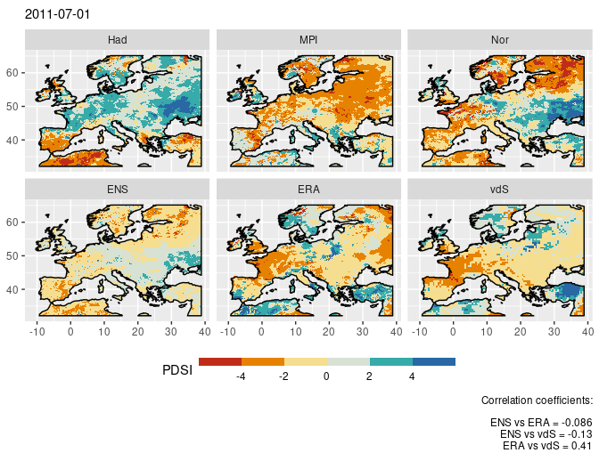
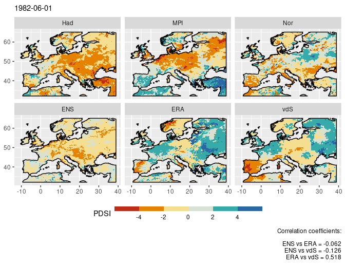
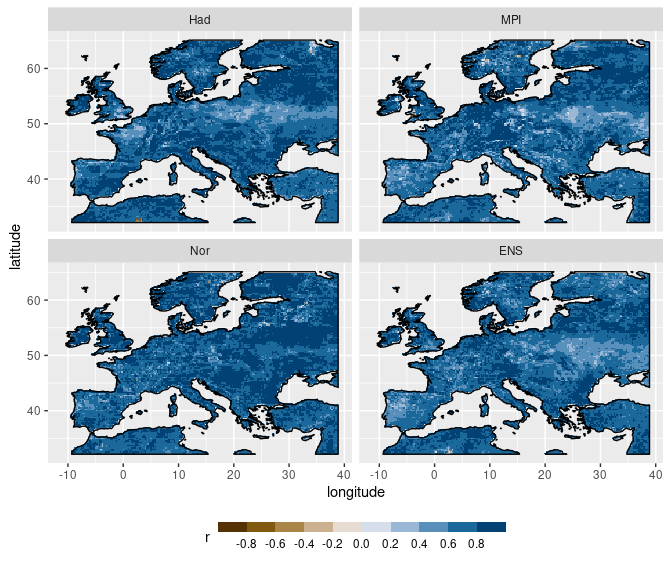
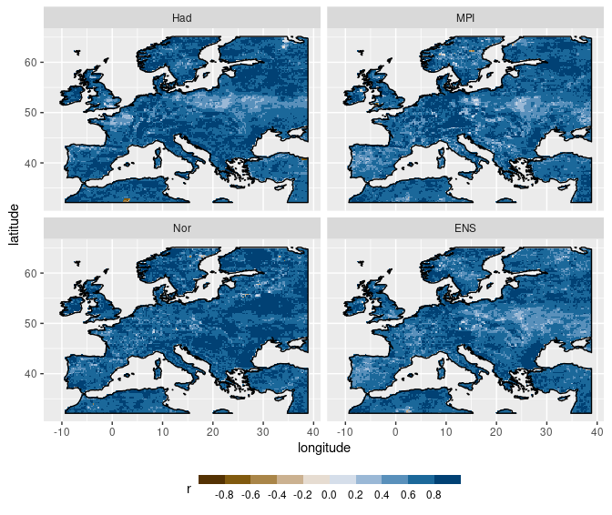

Report 2: REMO vs ERA vs vdS - 1979-2020
================
Carlos Dobler

-   [Temporal comparisons](#temporal-comparisons)
-   [Spatial comparisons](#spatial-comparisons)
-   [Bonus: How does my REMO-derived scPDSI compares with
    Isabelle’s?](#bonus-how-does-my-remo-derived-scpdsi-compares-with-isabelles)

Here I compare scPDSI spatio-temporal patterns between REMO2015, ERA5,
and van der Schrier et al. **for 1979-2020**. REMO-dervied scPDSI was
calculated from scratch, using the same methods I used for ERA5 in order
to keep consistency. That includes using the whole temporal period
(1979-2020) for calibration.

## Temporal comparisons

The following figure shows per-pixel correlations between pairs of data
sources. REMO models as well as their ensemble display poor correlation
with both ERA5-derived and van der Schrier’s scPDSI. In many regions the
correlation is actually negative, indicating “mirrored” scPDSI dynamics
between models. As shown in the previous report, per-pixel correlation
between ERA5 and van der Schrier is overall high (and positive).

The following plots compare scPDSI time-series from the REMO ensemble,
ERA5, and van der Schrier. Each triad of plots corresponds to a
randomly-chosen pixel. The figures show how ERA5 and vdS time-series
tend to display a high correspondence between them, while dynamics from
the REMO ensemble do not seem to resemble any of them (nor did
individual REMO models, not shown here).

## Spatial comparisons

The following figure shows how scPDSI from the REMO ensemble, ERA5, and
vdS correlate spatially. In all cases, correlation coefficients
fluctuate over time in a “wave-like” form. When correlated against ERA5
and vdS, the REMO ensemble displays the lowest correlations overall (two
upper plots). In many years, this correlation is actually negative
(i.e. regions with a positive scPDSI in either ERA5 or vdS have a
negative scPDSI in REMO, and *vice versa*). Spatial correlation between
ERA5 and vdS (bottom) follows the same pattern as shown in the previous
report.

The following three set of maps show REMO models and their ensemble, as
well as ERA5 and vdS scPDSI for a randomly-chosen date, in an attempt to
show how spatial patterns differ between data sources.

## Bonus: How does my REMO-derived scPDSI compares with Isabelle’s?

The following maps show temporal correlations between my scPDSI
calculations and Isabelle’s with REMO. Correlations are positive and
very high overall. For the ensemble, some discrepancies are seen over
Eastern Europe and western Spain.

Could discrepancies be due to the fact that Isabelle adjusts for CO2
levels? The following maps show correlations after I do the same.
Results do not seem to change much.

