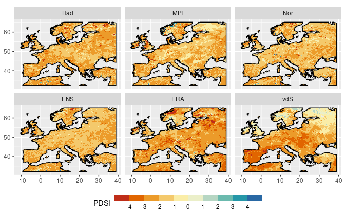
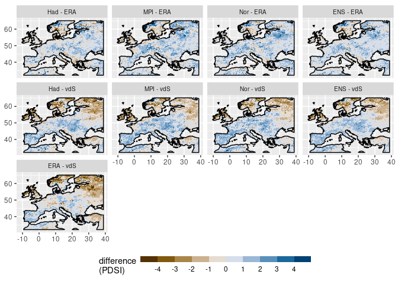
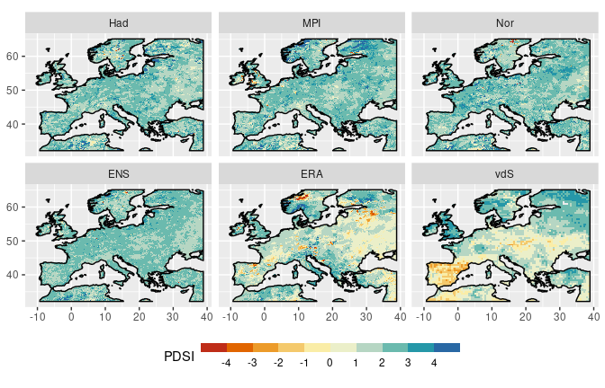
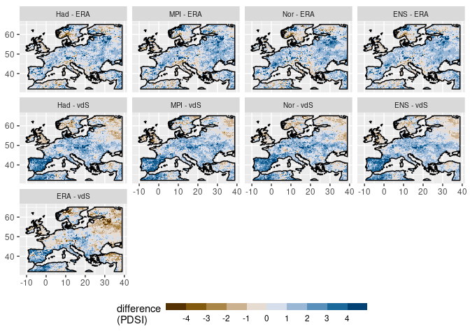
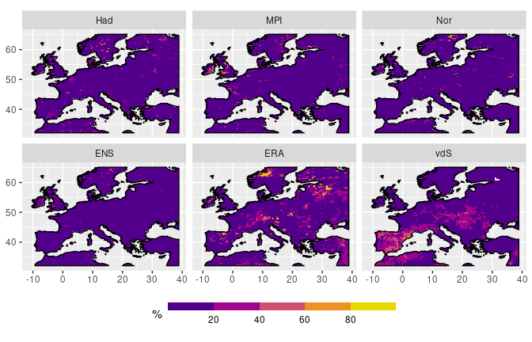
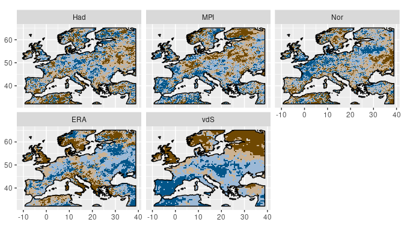
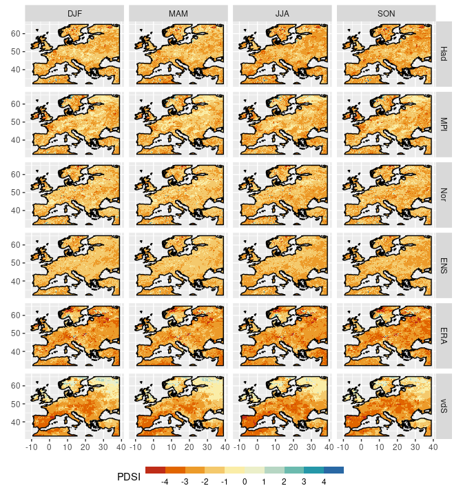
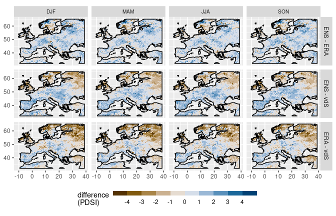
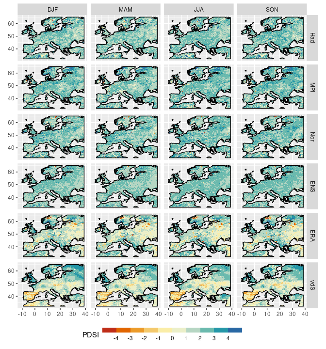
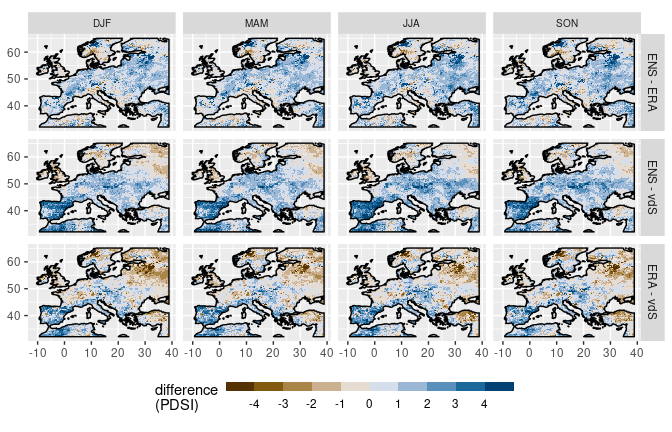

Report 3: REMO vs ERA vs vdS - 1 degree world
================
Carlos Dobler

-   [1. Annual patterns](#1-annual-patterns)
-   [2. Seasonal patterns](#2-seasonal-patterns)

This 3rd report compares scPDSI obtained from REMO2015, ERA5, and van
der Schrier et al. **in a +1 degree world**. Same as the previous
report, scPDSI from REMO2015 was calculated from scratch, and likewise,
the calibration period includes the whole temporal period (1979-2020).

Comparison methods used here differ from those of previous reports since
data sources sliced to correspond to 1 degree do not share the same
temporality. Thus, I compared spatial patterns of 20th and 80th
percentiles between data sources both annually and seasonally.

## 1. Annual patterns

### 1.1. 20th percentile

The following maps show the 20th percentile of scPDSI of the different
data sources. Compared to ERA5 and vdS, REMO models tend to depict less
severe levels of extreme drought.

Differences can better be appreciated in the following figure, which
shows pair-wise comparisons (subtractions) between data sources. In
general, REMO models tend to show lower levels of extreme drought than
ERA5. This is also true when compared to vdS, but only for central and
western Europe. In eastern Europe/Russia, REMO models tend to show
higher levels of drought than vdS. ERA and vdS show considerable
discrepancies in the Scandinavian peninsula and eastern Europe/Russia.

### 1.2. 80th percentile

The following maps show the 80th percentile of the different data
sources’ scPDSI. Compared to ERA5 and vdS, REMO models tend to display
wetter conditions. In fact, ERA5 and vdS show considerable areas with
negative PDSI, which does not happen in REMO models.

The following figure shows pair-wise differences between data sources
for the 80th percentile. The figure confirms that REMO models present
wetter conditions than ERA5 and vdS.

### 1.3. Percent of months with severe drought (\< -3 PDSI)

### 1.4. EOFs

## 2. Seasonal patterns

### 2.1. 20th percentile

The following figure shows maps of the 20th percentile scPDSI for the
different data sources over different seasons. Again, it shows that ERA5
and vdS tend to depict drier conditions than REMO models.

The following figure shows pair-wise comparisons between data sources
(only REMO ensemble).

### 2.2. 80th percentile

The following figure shows maps of the 80th percentile scPDSI for the
different data sources over different seasons. As in the annual
patterns, it shows that ERA5 and vdS tend to depict drier conditions
than REMO models, again, with considerably sized regions displaying
negative PDSI values in the former.

The differences mentioned above can better be appreciated in the
following figure. The most notable area of divergence is in the Iberian
peninsula between the REMO ensemble and vdS. When comparing ERA5 and
vdS, eastern Europe/Russia also displays considerable divergence between
datasets.

